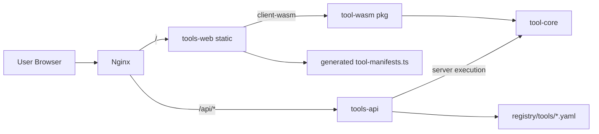
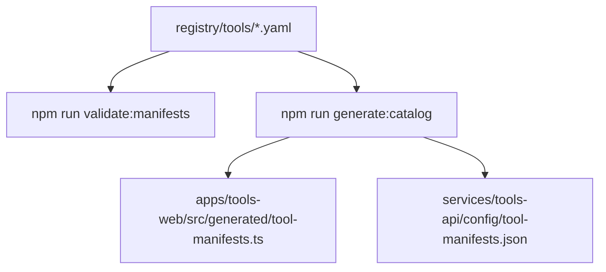

# 架构文档

## 1. 系统边界

`tools-subsite` 是独立子站，部署在 `tools.domain.xxx`，与主博客系统（如 Hugo）完全解耦。

- 主博客：独立站点与仓库，不在本项目内。
- 工具子站：仅负责工具目录、工具页面、工具执行。

## 2. 核心模块

### 2.1 前端 `tools-web`

- 路由：
  - `/`：工具总览页（书简卡片）
  - `/:toolSlug`：工具执行页
- 运行时：
  - `wasmRuntime`：执行 `client-wasm`
  - `serverRuntime`：执行 `server-api`
  - `ToolEntryPage`：实现 `hybrid` 回退逻辑

### 2.2 后端 `tools-api`

- 框架：`Axum`
- 接口：
  - `GET /api/tools/v1/list`
  - `POST /api/tools/v1/run/{tool_id}`
  - `GET /api/healthz`
  - `GET /api/readyz`
- 运行时约束：
  - 请求体限制：`1MB`
  - 输入长度限制：`MAX_INPUT_CHARS = 20000`
  - 执行超时：`RUN_TIMEOUT_SECONDS = 3`

### 2.3 Rust 核心与 WASM

- `crates/tool-core`：算法核心（可复用）
- `crates/tool-wasm`：`wasm-bindgen` 导出浏览器可调用函数

### 2.4 工具注册体系

- 清单目录：`registry/tools/*.yaml`
- Schema：`schemas/tool-manifest.schema.json`
- 生成产物：
  - 前端：`apps/tools-web/src/generated/tool-manifests.ts`
  - 后端：`services/tools-api/config/tool-manifests.json`

## 3. 模块关系图



## 4. 请求与执行链路

### 4.1 `client-wasm`

1. 用户在 `/:toolSlug` 输入参数。
2. 前端调用 `runWasmTool()`。
3. WASM 包执行 `tool-core` 逻辑。
4. 浏览器直接返回结果，不经过 API。

### 4.2 `server-api`

1. 前端调用 `runServerTool(api_endpoint, tool_version, input)`。
2. `tools-api` 校验 `tool_id`、`tool_version`、输入结构与大小。
3. API 在服务端执行对应工具逻辑并返回统一响应。

### 4.3 `hybrid`（WASM 优先）

1. 前端优先尝试 WASM。
2. 当以下任一条件触发时回退到 API：
   - 输入超过前端 guardrail（当前 `MAX_WASM_INPUT_CHARS = 5000`）
   - WASM 执行失败
3. 前端标记执行路径为 `server-api (fallback)`。

## 5. 配置与生成流程



说明：
- `validate-manifests.mjs`：仅做 Schema 校验。
- `build-tool-catalog.mjs`：做字段/重复性/保留 slug 检查并生成目录产物。

## 6. 运行时约束与错误语义

### 6.1 工具执行模式

- `client-wasm`
- `server-api`
- `hybrid`

### 6.2 API 统一响应结构

```json
{
  "success": true,
  "data": {},
  "error": null,
  "meta": {
    "duration_ms": 0,
    "executor": "server-api",
    "version": "0.1.0"
  }
}
```

### 6.3 常见错误码

- `TOOL_NOT_FOUND`
- `VERSION_MISMATCH`
- `INVALID_INPUT`
- `INPUT_TOO_LARGE`
- `RUN_TIMEOUT`
- `RUN_FAILED`

## 7. 部署拓扑

- Nginx：服务器 native 部署
  - `root /var/www/tools/current`
  - `/api/* -> 127.0.0.1:18080`
- tools-api：Docker 运行，由 systemd 托管
  - 服务文件：`deploy/systemd/tools-api.service`
  - 环境文件：`/etc/tools-api/tools-api.env`
- 发布回滚：
  - 发布脚本：`deploy/scripts/release.sh`
  - 回滚脚本：`deploy/scripts/rollback.sh`

## 8. 关键扩展点

- 新增工具元数据：`registry/tools/*.yaml`
- 新增前端执行逻辑：
  - `apps/tools-web/src/lib/runtime/wasmRuntime.ts`
  - `apps/tools-web/src/pages/ToolEntryPage.tsx`
- 新增服务端执行逻辑：
  - `services/tools-api/src/lib.rs` 中 `match tool.id.as_str()` 分支

